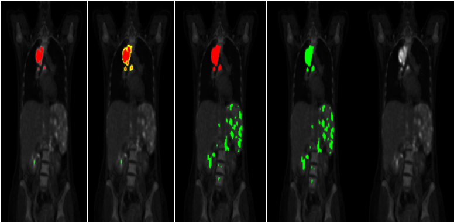

# PLT: PET/CT Labeling and Model Review Tool

PLT is a desktop application for creating and reviewing three-dimensional lesion annotations in PET/CT studies. I developed it during my Master's research on automatic Hodgkin lymphoma lesion segmentation in 18F-FDG PET/CT.

The tool was designed together with nuclear medicine specialists at Shariati Hospital. Its purpose was to turn expert interpretation into voxel-level annotations that could be used directly for medical image analysis and deep learning. It was later used to review model-generated lesion masks, allowing specialists to correct missed lesions, false detections, and inaccurate boundaries.


## Why PLT was developed

Reliable three-dimensional annotations were necessary for training and evaluating our lesion segmentation model. The available free viewers either did not produce masks in the PET image coordinate space or required substantial post-processing. Commercial alternatives were also unsuitable for the practical constraints of the project.

PLT was therefore developed around the annotation workflow used by our clinical collaborators. The interface combines PET and CT information, threshold-based identification of high-uptake regions, seeded region growing, and manual expert correction.

The resulting annotations were used in a study of 181 pretreatment PET/CT examinations of patients with Hodgkin lymphoma.

## My role

I designed and implemented the application and was responsible for its technical development.

My work included:

- translating clinical requirements into the annotation workflow and user interface;
- implementing PET and CT DICOM loading and visualization;
- creating axial, coronal, and sagittal navigation;
- implementing fused PET/CT display with adjustable opacity, colour mapping, and CT windowing;
- implementing ROI-based uptake and SUV calculations;
- adding PERCIST-guided and manually adjustable thresholding;
- implementing two-dimensional and three-dimensional seeded region growing;
- implementing lesion labelling, boundary correction, undo/redo, and annotation persistence;
- supporting the review and correction of model-generated lesion masks;
- refining the application through repeated feedback from nuclear medicine specialists.

The application was developed as research software for my Master's thesis under the supervision of Dr. Nafiseh Alemohammad and Dr. Parham Geramifar.

## Main features

### PET/CT visualization

PLT supports:

- axial, coronal, and sagittal views;
- synchronized navigation through three-dimensional PET and CT studies;
- fused PET/CT visualization;
- adjustable image opacity and colour maps;
- zooming and slice navigation;
- configurable CT display windows.

PET provides information about metabolic activity, while CT provides anatomical detail. Their combined display helps specialists distinguish suspicious uptake from physiological uptake in organs and other normal tissues.

### Threshold-based candidate regions

Users can define an uptake threshold manually or estimate one from a selected region of interest.

PLT includes a PERCIST-guided workflow in which the user selects a liver region and the application calculates an uptake-based threshold. Voxels above the selected threshold are displayed as candidate regions. The threshold remains adjustable because uptake alone is not sufficient to determine whether a region is tumoral.

### Two-dimensional and three-dimensional labelling

A user can select a candidate region and apply seeded region growing to label connected voxels.

The application supports:

- 2D region growing within the current slice;
- 3D region growing across the image volume;
- different neighbourhood definitions controlling how connected voxels are selected;
- separate labels for tumoral and suspicious regions.

These options allow the specialist to choose between faster volumetric labelling and more controlled slice-level correction.



### Expert correction

Annotations remain editable after they are created. Specialists can:

- add missed regions;
- remove false detections;
- change suspicious regions to tumoral regions or vice versa;
- refine boundaries by modifying the threshold;
- undo and redo recent changes.

Existing annotations can be reopened and modified. During our research, this functionality was also used to present model-generated masks to specialists for review and correction.

### Annotation output

Annotations are maintained in the PET voxel coordinate space. PLT saves labelled voxel coordinates and their associated thresholds in a sparse JSON file rather than storing an entire dense volume in JSON.

The saved annotations can be reopened in PLT or reconstructed as three-dimensional masks for model training and evaluation.

## Research context

PLT supported the annotation and review workflow for the following study:

> M. A. Izadi, N. Alemohammad, P. Geramifar, A. Salimi, Z. Paymani, R. Eisazadeh, R. Samimi, B. Nikkholgh, and Z. Sabouri.  
> “Automatic Detection and Segmentation of Lesions in 18F-FDG PET/CT Imaging of Patients with Hodgkin Lymphoma Using 3D Dense U-Net.”  
> *Nuclear Medicine Communications*, 45(11), 963–973, 2024.

The study used 181 anonymized pretreatment PET/CT examinations. The annotations created through the clinical workflow formed the reference masks used to train and evaluate the segmentation model.

## Running the application

Clone the repository:

```bash
git clone https://github.com/m-aminiz/PLT.git
cd PLT
```
Create and activate a virtual environment:

```bash
python -m venv .venv
```

On Windows:
```bash
.venv\Scripts\activate
```

On Linux or macOS:
```bash
source .venv/bin/activate
```

Install the dependencies:
```bash
pip install -r requirements.txt
```

Run the application:
```bash
python PltApp.py
```

When opening a study, PLT asks for three directories:

a directory containing the PET DICOM series;
a directory containing the CT DICOM series;
a directory used to load or save the annotation file.

If the third directory already contains a compatible label.json file, the existing annotations are loaded for review.

## Data availability and privacy

The clinical PET/CT studies used in the research cannot be included in this repository because they contain sensitive medical data and are governed by ethical and institutional restrictions.

No patient DICOM data should be committed to this repository. Users are also responsible for ensuring that exported annotation files do not contain identifiable patient metadata before sharing them.

## Limitations

PLT was developed as a research prototype for a specific PET/CT annotation workflow. It has not been certified as a medical device and is not intended for independent clinical diagnosis or treatment decisions.

The current implementation expects PET and CT DICOM series with the metadata required by the application. Compatibility with other scanners, tracers, acquisition protocols, or DICOM organisations has not been systematically tested.

## Author

Mohammad Amin Izadi
Medical AI Researcher and AI Engineer


